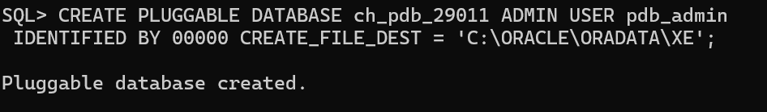
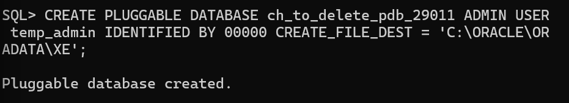
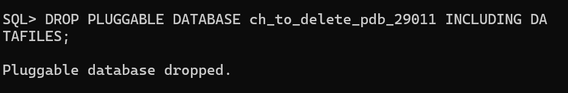

Oracle Pluggable Database Management – Assignment II

Student: NGANJI BIREZI CHRISTELLE

Student ID: 29011

Course: INSY 8311 Database Development with PL/SQL  

Overview
This assignment demonstrates hands-on Oracle Multitenant architecture skills by creating, managing, and deleting Pluggable Databases (PDBs) in Oracle 21c. The environment simulates a banking infrastructure where isolated PDBs will host future customer and transaction systems.

 Oracle Environment
- Database: Oracle 21c Enterprise Edition  
- Client Tool: SQL*Plus, SQL Developer Extension (VS Code)  
- OS: Windows 11  
- OEM Port: 5500 (HTTPS)

 Task Execution

Task 1: Permanent PDB Creation
- Created PDB: ch_pdb_29011
  
)
- Created user: christelle_plsqlauca_29011 with DBA privileges
  
- PDB is open and ready for application deployment
  

Task 2: Temporary PDB Lifecycle
- Created: ch_to_delete_pdb_29011
   
- Verified existence
  
- Dropped with INCLUDING DATAFILES
  
- Confirmed removal
   

Task 3: Oracle Enterprise Manager
- OEM Express enabled on port 5500
    
- Dashboard confirms PDB status and environment health
  

 Challenges & Solutions

- Challenge: PDB not opening after creation  
  Solution: Ran ALTER PLUGGABLE DATABASE ... OPEN; explicitly

Integrity Statement
All commands were executed personally on my local Oracle 21c instance. Screenshots reflect my own terminal and OEM sessions. No AI tools were used to generate commands or solutions.

 Submission Info
- PDB Name Created: ch_pdb_29011  
- Issues Encountered: Yes (resolved as above)
